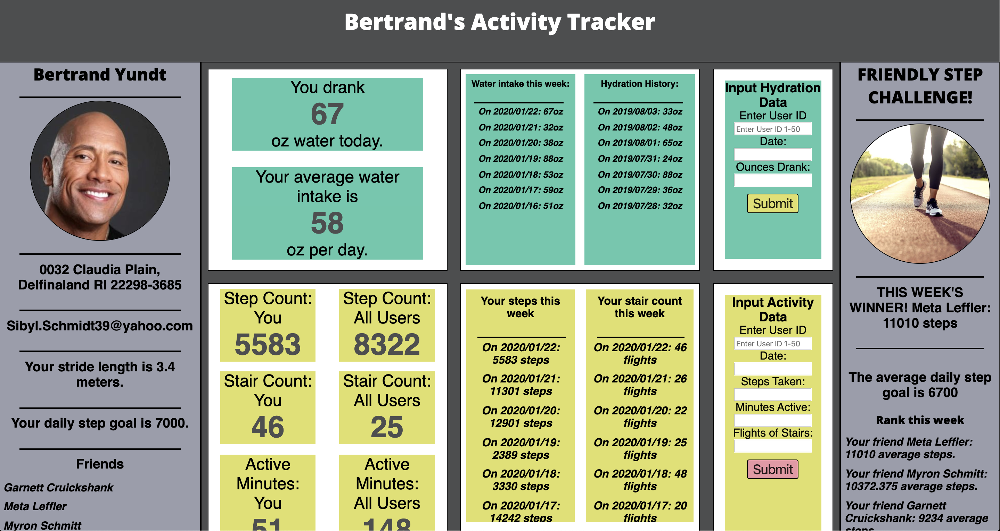
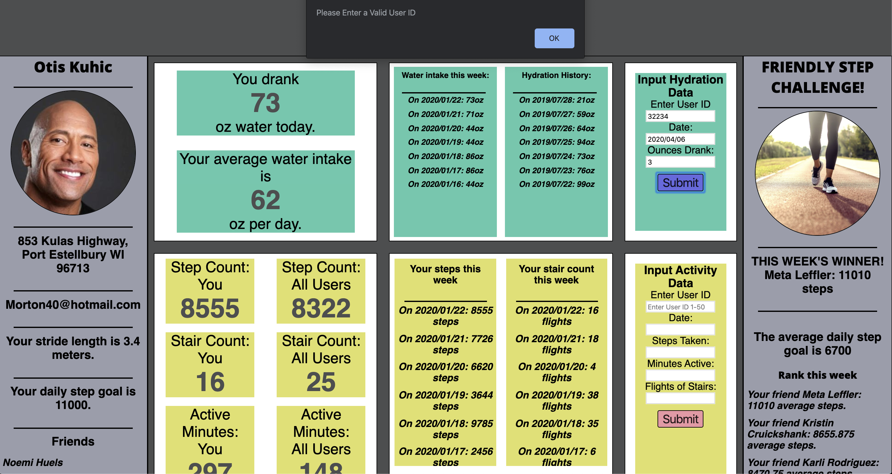
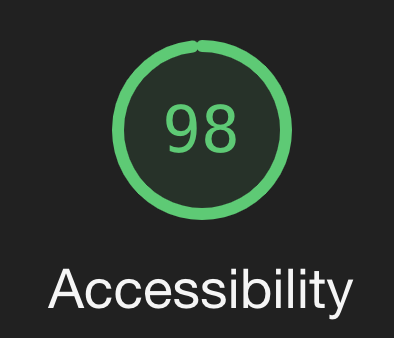

# Refactor Tractor

## Abstract

This project refactors an already-existing codebase of a fitness and lifestyle tracking application. The major changes include:
1. Refactor the major classes and carry out implementation of the `domUpdates` class.
1. Robust testing with spies.
1. Addition of Sass.
1. Addition of accessibility features (e.g. contrasting colors, ordered tabbing, descriptive tags).
1. Added ability to submit new fitness data.

## Setup

1. Clone down this repo into your desired folder.
1. Run: `npm install js-datepicker`.
1. Run: `npm install`.
1. Open project in browser at address: http://localhost:8080/

## Contributors
* [Kimala](https://github.com/kimalajoy)
* [Brian](https://github.com/broxbury)
* [Kyle](https://github.com/KCWill)

## Composition

  

  

